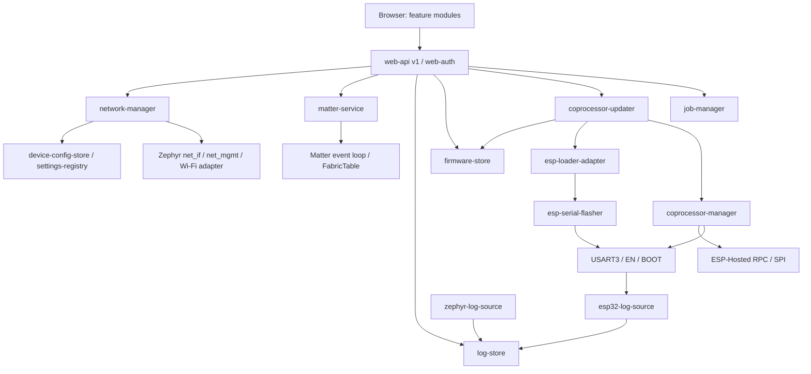

# План разработки устройства и веб-интерфейса

> **Состояние на 2026-09-12.** P0 частично, **P1 закрыт**. Готовы четыре
> модуля — `job-manager`, `device-config-store`, `api-validation`,
> `network-manager` — 124 sim-теста; mock-сервер и контрактные проверки в
> `tools/api-contract` — 233 теста; наборы проверены 113 мутациями реализации,
> все пойманы. CI заведён: `.github/workflows/checks.yml` гоняет контрактные
> проверки и `sim`-набор на каждый push и pull request. Отметки
> `~~зачёркнуто~~` и колонки «Статус» в разделах 3, 10 и 12 показывают, что
> именно сделано.
>
> Ни один модуль ещё не работал на плате: `sim` проверяет автоматы, а mock —
> контракт, ни то ни другое не проверяет поведение LittleFS, W5500 и C6.
> Аппаратные строки таблиц раздела 12 и матрица раздела 11 остаются долгом.

## 1. Результат и границы первой версии

Веб-приложение обслуживается самим STM32, работает без интернета и доступно через Ethernet и Wi-Fi. Функции:

1. Состояние устройства, сети, Matter и ESP32.
2. Открытие и закрытие окна Matter commissioning; QR, ручной код подключения и setup PIN; список текущих Matter fabrics.
3. Просмотр и выгрузка логов STM32 и ESP32, фильтры, пауза и продолжение просмотра.
4. Загрузка файла прошивки ESP32 из браузера, проверка образа, запись через UART, прогресс и результат проверки запуска.
5. Ethernet и Wi-Fi: параметры интерфейсов, сканирование Wi-Fi, SSID/пароль, DHCP или статический IPv4, DNS, сохранение и безопасное применение.
6. Сессия администратора и смена пароля; локальный доступ с паролем подтверждён владельцем.

Под «фабриками» понимаются Matter fabrics: актуальные доверенные объединения, в которых устройство зарегистрировано. Fabric не равна одному телефону или контроллеру. История удалённых fabrics и список всех контроллеров внутри fabric — отдельные функции, сейчас не включены. Удаление fabrics, factory reset, OTA самого STM32, MQTT UI, настройка реле/входов, Thread и облачный доступ также вне нового объёма первой версии.

Решения владельца, зафиксированные после первого чтения плана:

- **ESP32 прошивается только по UART.** ESP-Hosted OTA остаётся спланированным и описанным в контракте, но в этой версии не реализуется: `capabilities.features.esp32_ota.available=false`, `POST /coprocessor/updates` с `method="ota"` отклоняется. Работа вынесена за пределы первой версии.
- **UART flasher — библиотека `espressif/esp-serial-flasher`** версии v2.0.0, подключаемая как west-модуль. Свой протокол ROM loader не пишется (см. раздел 8).
- **Фронтенд пишется с нуля.** Существующий submodule `src/web/frontend` не выкачивается и не переиспользуется; его запись удаляется из `.gitmodules` в P0.
- **HTTPS не требуется.** Веб-интерфейс работает по HTTP в локальной сети; последствия описаны в разделе 9.
- **SoftAP нужен**, но реализуется только после того, как прошивка ESP32 по UART из веб-интерфейса подтверждена на плате: SoftAP зависит от прошивки C6, которую эта функция и позволяет менять.

API для legacy-функций уже есть; при миграции определить их потребителей. Нельзя оставлять старый незащищённый маршрут перезагрузки/прошивки в обход новой авторизации.

## 2. Что уже есть и чего не хватает

| Область | Факты из исходников | Необходимая работа |
|---|---|---|
| HTTP | `src/web/http_server_init.c`: порт 80, 4 клиента; обработчик неизвестных URL перенаправляет на `/` | Разделить SPA fallback и JSON 404; единый API v1, контексты запросов, обработка abort, лимиты |
| Фронтенд | `.gitmodules`: отдельный `src/web/frontend`, gitlink `ec332cb…`; каталог пуст | Решением владельца не используется: удалить запись submodule, написать приложение с нуля под API v1 |
| Сборка UI | Корневой CMake перечисляет `dist` при конфигурации; `frontend_build` вызывает `npm install` | Переписать под новый фронтенд: сборка по lockfile (`npm ci`), зависимость firmware от готового `dist`, генерация списка файлов на этапе build, а не configure |
| Авторизация | `authentication.c` и login в основном закомментированы, init выключен | Новый завершённый session flow, единая проверка для всех маршрутов |
| Matter API | `/api/matter/control`: basic window, число fabrics, QR/manual code; глобальные буферы; возвращает успех постановки в очередь | Сервис Matter, async jobs, проверка готовности/ошибок, список fabrics, корректные коды и окна |
| Matter startup | `start_matter()` спит 5 секунд до постановки работы; NetworkCommissioning сообщает Ethernet connected=true | Убрать задержку из callback, привязать состояние к реальным интерфейсам; проверить mDNS и IPv6 |
| Настройки | `modules/settings-registry` подключён, имеется persistent store поверх Zephyr Settings. **P0, решение владельца:** весь код приложения ходит в настройки только через settings-registry (MQTT — ключи `mqtt/*`; прямых `settings_*` в `src/` нет); legacy `/api/relays/safe_state` удалён. Бэкенд — один файл `/lfs/settings` (`SETTINGS_FILE`, 128 строк) на реестр и Matter: чтение ключа по коду квадратично от длины файла, измерено ~0,12 с на ключ, файл растёт с каждым стартом Matter | Доменная схема сети, версии, транзакции, восстановление, секреты; реестр по ключам сам по себе не даёт атомарность нескольких ключей. Решить бэкенд хранения (размер файла, `MAX_LINES` или ZMS/NVS на отдельном разделе) до P4 — сетевые транзакции пишут много ключей |
| Ethernet | `net_init.c` выбирает W5500 по устройству, задаёт MAC, запускает DHCP | Единый владелец IPv4/DNS/маршрута; runtime status отдельно от сохранённой конфигурации |
| Wi-Fi | `esp_hosted_mcu`, scanning через shell; драйвер запускает DHCP на StaConnected | API scanning, соединение/таймауты, reconnect, отключение auto-DHCP при static |
| ESP32 управление | `plugin_wifi`: EN/BOOT, reset/download; USART3 соединён с C6, есть Zephyr UART bridge | Единственный владелец UART, режимы console/flashing/USB bridge, контролируемый reset |
| ESP32 OTA | В Zephyr `.proto` есть OTA Begin/Write/End/Activate, драйвер даёт `esp_hosted_mcu_rpc_call()`, но реализации OTA нет; поддержка со стороны CP не проверена | Отложено: в первой версии не реализуется, контракт и место в API сохранены |
| ESP32 образы | Соседний CP проект: 4 МБ flash, два app slot по `0x1C0000`; rollback в sdkconfig выключен | Прочитать фактическую таблицу разделов с чипа; определить, какой slot пишет UART updater и как выбирается загрузка; совместимые релизы и health-check |
| UART flasher | Реализации протокола ROM loader в дереве нет; `esp-serial-flasher` в манифест не добавлен | Добавить `esp-serial-flasher` v2.0.0 через `zephyr/submanifests/`, описать DT-узел `espressif,esp-loader` в overlay платы, написать тонкий адаптер и передачу владения UART |
| Обновление STM32 | `/upload` пишет `slot1_partition` и помечает MCUboot pending | Это другой target: не использовать как ESP32 updater |
| Память/загрузка | В памяти Claude: PSRAM relocation собрана; последняя проверка запуска не закончена | Чистая сборка, стабильный boot, map, stress до UI и обновления C6 |
| Планировщик и Ethernet | Поток W5500 создаётся как `K_PRIO_COOP(2)` и внутри `while (int_pin) w5500_check_for_ir()` делает **синхронный опросный** обмен по SPI, не уступая процессор. Под мультикаст-флудом это полностью останавливало логи и шелл | Симптом снят блокировкой флуда, но причина хрупкости осталась: достаточный поток в сегменте снова положит систему. Сделать поток вытесняемым либо ограничить внутренний цикл — до нагрузочных испытаний P8 |
| Мультикаст-флуд | Счётчики в драйвере (временная инструментация, снята) показали ~271 принятый кадр в секунду по ~1256 байт, буфер приёма чипа постоянно занят 9–10 КБ. Ошибочных путей ноль: `ir_zero`, `rx_readbuf_err`, `rx_bad_header`, `rx_alloc_fail` — все нули. Заголовки кадров: dst `01:00:5e:7f:0c:02` и `01:00:5e:7f:0c:04`, то есть IPv4-мультикаст групп 239.255.12.2/4, около 2,7 Мбит/с чужого потока в сегменте | **Устранено 2026-09-12** локальным патчем драйвера: в `Sn_MR` добавлен бит MMB (5) — аппаратная блокировка IPv4-мультикаста в MACRAW. IPv6 не затронут (MIP6B, бит 4, остаётся сброшен), проверено ответом платы на `ff02::1` |
| HTTP только на IPv4 | `net conn` на плате показывает `0.0.0.0:80` и **отсутствие** `[::]:80`: веб-сервер слушает только IPv4. Matter при этом работает по IPv6 | Решить, нужен ли доступ к веб-интерфейсу по IPv6. Если нужен — это отдельная задача P2, а не побочный эффект настройки сети |
| Выбор бита фильтрации | Проверено двумя независимыми методами (счётчики в драйвере с обратным чтением `Sn_MR` и чёрный ящик с холодного проводного пира): `MMB` режет только IPv4-мультикаст, `MIP6B` — только IPv6-мультикаст. Но с `MIP6B` плата теряет SLAAC-адрес и становится недостижима по IPv6 для любого пира без записи в кэше соседей | **Использовать только `MMB`.** `MIP6B` на этом изделии применять нельзя: Matter живёт на IPv6-мультикасте |
| Носитель | По merged DTS: SPI NOR 16 МБ содержит `storage_lfs` `0x000000`+6 МБ (не используется), `image-1` `0x600000`+4 МБ, `storage_nvs` `0xa00000`+5 МБ (на нём смонтирован `/lfs`), `image-scratch` `0xf00000`+64 КБ; QSPI W25Q128 несёт `image-0` `0x000000`+4 МБ (XIP) | Карта установлена. Решением владельца staging прошивки C6 — файл в LittleFS. Измерить свободное место `/lfs`, при нехватке расширить раздел за счёт неиспользуемого `storage_lfs`; привести метки разделов в соответствие назначению |

Документация settings-registry описывает тесты из исходного проекта, но их каталоги здесь не присутствуют. Не считать это доказательством тестирования текущей интеграции.

## 3. Модульная архитектура

Модуль — отдельный каталог, публичные заголовки, приватная реализация, CMake, Kconfig и README с жизненным циклом, потоками, владением ресурсами и ошибками. Новые переиспользуемые модули размещать в `modules/`, прикладные адаптеры — в `src/services/`, HTTP binding — в `src/web/api/v1/`. Не создавать отдельный поток для каждого каталога: только для работы, которой он нужен.

| Модуль | Ответственность и публичный интерфейс | Что ему не принадлежит | Статус |
|---|---|---|---|
| `settings-registry` (существующий) | Типизированные ключи и уведомления | HTTP, политики сети, атомарность групп ключей | существовал до плана |
| `device-config-store` | Версии схем, secret storage, атомарные config snapshots, pending/committed generations | Сетевые подключения | **готов** — 33 теста, 10 мутаций |
| `job-manager` | Идентификаторы задач, состояния, прогресс, дедупликация, ограниченная история | Конкретные драйверы | **готов** — 17 тестов, 3 мутации |
| `network-manager` | `get_status`, `scan`, `stage_config`, `apply`, `confirm`, `rollback`; Ethernet/Wi-Fi adapters | JSON и UI | **ядро готово** — 51 тест, 18 мутаций; адаптеры Ethernet/Wi-Fi за P4 |
| `matter-service` | Состояние стека, commissioning window, onboarding codes, FabricTable snapshots | HTTP и HTML; прямое управление Wi-Fi | не начат |
| `log-store` | Ограниченные кольцевые буферы, cursor, потери, фильтрация, экспорт | Сетевые отправки из log callback | не начат |
| `zephyr-log-source` | Zephyr log backend → log-store; ранние сообщения по возможности | Долгое форматирование/flash I/O в ISR | не начат |
| `coprocessor-manager` | Состояние C6, transport health, EN/BOOT, эксклюзивное владение USART3, режим UART | HTTP и формат пакета прошивки | не начат |
| `esp-loader-adapter` | Тонкая обёртка над `esp-serial-flasher`: получение handle по DT-узлу, передача владения UART от `coprocessor-manager` и возврат, вызовы connect/erase/write/verify, трансляция кодов ошибок библиотеки в `ErrorDetail`, отчёт о прогрессе, гарантированная уборка GPIO и сброс в normal boot при любом исходе | Сам протокол ROM loader (реализован библиотекой), политика обновления, формат файла | не начат; библиотека подключена |
| `esp32-log-source` | UART bytes → строки/records, reconnect/reset markers, ANSI sanitization | Второй UART callback рядом с flasher/bridge | не начат |
| `firmware-store` | Upload chunks в файл LittleFS, квота staging, SHA-256, image/compatibility validation; расширение для manifest/signature | Прошивка чипа | не начат |
| `coprocessor-updater` | Автомат обновления, в первой версии только UART backend поверх `esp-loader-adapter`, проверка запуска и recovery. Точка расширения для OTA backend сохранена, но не реализована | Загрузка HTTP body, произвольные адреса от браузера, протокол ROM loader | не начат |
| `web-auth` | Локальный admin, login/logout/password, cookie/CSRF, bounded sessions | Пользователи Matter fabrics | не начат |
| `api-validation` (добавлен) | Коды ошибок и их HTTP-статусы, тело ошибки, строгие парсеры адресов и идентификаторов | Политика: подсеть, достижимость, состояние | **готов** — 23 теста, 11 мутаций |
| `web-api` | HTTP маршрутизация, JSON schemas, auth middleware, request contexts, вызовы сервисов | Бизнес-логика и ожидание завершения операций | не начат; коды ошибок и разбор готовы в `api-validation` |
| `web-assets` | Встраивание dist, MIME, gzip, ETag, index cache policy | Сетевые настройки и пароли | не начат |

Правила интеграции:

- HTTP callbacks только валидируют, копируют ограниченные данные и ставят команды в очередь. Нельзя держать указатель на request body после callback.
- Длительная операция возвращает `202` и job. Ошибка выполнения не превращается в ложный HTTP «успех».
- Matter API вызывается на потоке Matter через `ScheduleWork`; snapshots формируются там же. Не держать CHIP lock при HTTP/flash/network I/O.
- Network callbacks копируют событие и сразу возвращаются; задержки, flash и reconnect выполняет network worker.
- Zephyr log backend не пишет в HTTP и не логирует собственное переполнение через тот же backend.
- UART RX callback один: `coprocessor-manager` переключает владельца, ждёт остановки RX/DMA и лишь затем передаёт ресурс.
- Обновление C6, сетевой apply, ручной reset C6 и USB programming взаимно исключаются. Scan запрещён при flashing/apply. Логи и чтение статуса доступны по оставшейся сети.
- Zephyr-порт `esp-serial-flasher` захватывает UART через `tty_serial` (`CONFIG_CONSOLE_SUBSYS`) и сам управляет GPIO сброса и BOOT по своему DT-узлу. Поэтому `coprocessor-manager` обязан полностью освободить USART3 и остановить RX/DMA **до** первого вызова библиотеки и вернуть себе канал после её завершения; одновременное владение недопустимо. То же относится к EN/BOOT: сейчас ими управляет `plugin_wifi`, этот код переходит под `coprocessor-manager`.
- Обычная смена сети не создаёт заново Matter Server и не стирает fabrics. События адресов обновляют discovery/маршруты.
- Переходы состояния и jobs не передавать через coalescing settings notifications: это отдельные очереди событий с явной обработкой переполнения.

## 4. Веб-приложение

Приложение пишется с нуля под API v1. Существующий submodule `src/web/frontend` не выкачивается и не переиспользуется, его запись удаляется из `.gitmodules` в P0; каталог становится обычной частью репозитория.

Стек выбирается в P2 по трём ограничениям: итоговый `dist` укладывается в бюджет gzip ≤ 512 КиБ, сборка воспроизводится по lockfile через `npm ci` без сети сверх registry, приложение работает без CDN и внешних шрифтов. Типы API client генерируются из `openapi.json`; ручное дублирование схем в коде запрещено, расхождение ловится сборкой. QR-код строится в браузере из `qr_payload`, без внешнего сервиса. Никакой аналитики, телеметрии и внешних запросов: устройство работает в изолированной сети.

Локализация: строки выносятся в один словарь с самого начала, даже если в первой версии язык один — набор языков уточняется владельцем в P0, и дооснащение готового кода дороже, чем дисциплина с первого экрана.

Предлагаемые feature-каталоги: `device`, `auth`, `matter`, `network`, `logs`, `coprocessor-update`; общие `api`, `components`, `state`, `i18n`. Feature вызывает API client; компоненты не содержат строк URL и не импортируют реализации чужих feature. Один ограниченный scheduler polling, отмена запросов при уходе со страницы, снижение частоты в фоновой вкладке.

| Экран | Содержимое и состояния |
|---|---|
| Обзор | Версии STM32/C6/UI, uptime, Ethernet/Wi-Fi, адрес доступа, Matter ready/fabrics, активная операция |
| Matter | Статус, открыть/закрыть окно, таймер по данным сервера, QR, ручной код и PIN как разные поля, таблица fabrics; empty/loading/error/unavailable |
| Сеть | Отдельные Ethernet/Wi-Fi формы, список AP с RSSI/security, скрытый SSID, пароль write-only, IPv4 DHCP/static, DNS, текущий и будущий адрес, подтверждение/откат |
| Логи | Источник STM32/ESP32/оба, уровень/module/text filter, пауза автопрокрутки, выгрузка, dropped/gap, время загрузки устройства |
| ESP32 | Версия, transport health, файл, результат проверки, прогресс по этапам, reconnect/recovery, причины недоступности. Способ записи в первой версии один — UART; OTA показывается как недоступная возможность с причиной от сервера, без отключённого переключателя-заглушки |
| Доступ | Login, смена пароля, logout; первый setup при выбранной модели авторизации. Явное предупреждение, что соединение идёт по HTTP в доверенной локальной сети |

Baseline live-логов — короткий cursor polling, а не долгие HTTP запросы. При четырёх клиентах это упрощает одновременную работу UI и upload. После измерений можно добавить один multiplexed WebSocket на вкладку, сохранив REST snapshots. Zephyr HTTP server поддерживает dynamic и WebSocket resources; поведение callbacks и лимиты сверять с локальной версией. [Документация Zephyr](https://docs.zephyrproject.org/latest/services/connectivity/networking/api/http_server.html).

UI должен работать с телефона и desktop, клавиатурой, без интернета/CDN. SSID и строки логов выводить как текст, не HTML. QR/manual code доступны только при открытом окне с известным payload; ошибки сети, пустые данные и отсутствие возможностей показываются явно.

## 5. Сеть и применение настроек

В v1 настраивается IPv4; IPv6 остаётся включённым с автоматической конфигурацией, его адреса отображаются. Matter требует проверить работу IPv6/mDNS независимо от выбора DHCP/static IPv4. Статический IPv6 и Enterprise Wi-Fi отложены. Wi-Fi security options приходят из capabilities и проверяются на установленной C6 firmware; минимум open, WPA2-PSK и WPA3-SAE после аппаратной проверки.

Конфигурация хранит stable IDs `ethernet`/`wifi`, не runtime net_if index. Предлагаемая политика: Ethernet preferred, Wi-Fi fallback; работоспособность определяется link/address/route, без зависимости от публичного ping-сервера. Два интерфейса в одной подсети проверить отдельно; наличие `net_if_set_default()` само по себе ещё не доказывает корректный выбор маршрута и DNS. Число DNS servers ограничить двумя в v1, согласовав с конфигурацией resolver.

Применение — транзакция, содержащая оба интерфейса и DNS policy:

1. Принять candidate с base revision, проверить всю конфигурацию и наличие пути восстановления.
2. Записать pending snapshot и предыдущую подтверждённую конфигурацию атомарно; проверить запись до изменения сети.
3. Вернуть job/transaction ID. После отправки ответа worker применяет изменения.
4. Запустить локальный таймер подтверждения 120 секунд. UI переподключается к предложенным адресам; `.local` — подсказка, а не гарантия нахождения.
5. Подтверждение разрешено лишь после проверки работоспособности изменённых включённых интерфейсов. Если браузер работает через неизменённый Ethernet, дополнительно проверить результат Wi-Fi connect/DHCP на устройстве.
6. По подтверждению атомарно заменить committed snapshot, увеличить revision. По timeout, отказу или перезагрузке до commit восстановить предыдущий snapshot.

DNS, DHCP ownership и Wi-Fi credentials применяет один сервис. Убрать безусловный DHCP-start из Wi-Fi adapter или добавить явный policy hook; поздний `dhcp_stop` после получения адреса не является достаточным решением static mode.

При первом запуске без сети базовый доступ — Ethernet DHCP.

SoftAP подтверждён владельцем как нужная функция, но реализуется отдельным этапом **после** того, как прошивка ESP32 по UART из веб-интерфейса подтверждена на плате. Причина порядка практическая: SoftAP работает на прошивке C6, и режим AP либо сосуществование STA/AP может потребовать другой сборки CP — сначала должна существовать проверенная возможность эту прошивку менять. До SoftAP установка без кабеля выполняется сервисным подключением, а не обещается через веб.

При реализации SoftAP проверить: поддержку AP в установленной CP firmware, одновременную работу STA и AP или явный переход между ними, выдачу адресов клиенту, доступность того же веб-интерфейса и правило возврата в обычный режим (таймаут либо явное завершение из UI). Пароль SoftAP не может быть общим для всех устройств.

Физическое восстановление сетевой конфигурации должно сохранять Matter fabrics; выбрать доступную кнопку/последовательность и описать владельцу до реализации.

## 6. Matter

- Проверить mDNS discovery, commissioning по Ethernet и затем при Wi-Fi-only. Текущий Ethernet-only NetworkCommissioning adapter нельзя автоматически считать полноценной реализацией Matter Wi-Fi commissioning.
- Для v1 предлагается on-network commissioning через заранее настроенную веб-интерфейсом сеть. BLE commissioning/передача Wi-Fi credentials через Matter controller — отдельный этап, если потребуется.
- API режима commissioning в v1: `basic`, сервер ограничивает timeout по возможностям закреплённого Matter SDK; типичный запрос 300 секунд. Показать, что basic использует существующие onboarding credentials.
- Дополнительная fabric должна добавляться без удаления прежних. Ограничения открытия basic window на уже commissioned устройстве проверить на закреплённом SDK и контроллерах; при необходимости реализовать enhanced flow до приёмки multi-admin.
- Enhanced window, открытое внешним контроллером, может содержать verifier без известного устройству passcode. В таком случае web API показывает окно и `codes_available=false`, не подставляет заводской QR. Локальную генерацию enhanced credentials добавить только отдельным проверенным adapter с правильными правилами administrator identity.
- `manual_pairing_code` и `setup_passcode` — разные значения. UI сохраняет ведущие нули. QR payload строится Matter SDK с актуальными rendezvous/discriminator; QR bitmap строится браузером.
- Fabrics читать из FabricTable: opaque ID, fabric index, fabric ID, node ID, vendor ID, label. Vendor ID не гарантирует название экосистемы, label может быть пустым; неизвестное имя не угадывать. Fabric index может переиспользоваться.
- Не выдавать приватные ключи, сертификатные секреты и pairing credentials в общие логи. Удалить текущий вывод onboarding codes из обычного log stream.
- Test credentials/DAC в текущем `matter_init.cpp` допустимы для разработки; отдельный этап product provisioning перед серийным выпуском, не подменять его веб-паролем.

## 7. Логи

RAM ring в PSRAM для STM32 и ESP32, ограниченный размер независимо от числа браузеров. Для каждой записи: source, boot ID STM32, sequence, uptime capture, wall time nullable, level nullable, module nullable, text и truncation marker. Для ESP32 добавить собственную generation при reset C6; временная отметка по умолчанию — время приёма STM32, не точные часы C6.

Сохранять 256 КиБ STM32 + 256 КиБ ESP32 как начальный бюджет, настроить по измерениям. UART line max 512 bytes, частичные строки сбрасывать по timeout, ANSI strip, некорректный UTF-8 заменять. Отдельно считать потери UART, backend и переписывание ring. Старый cursor даёт gap, новый boot — смену boot ID. Фильтрация не должна заставлять заново просматривать уже пройденные записи.

Выгрузка — ограниченный snapshot, NDJSON или text. По умолчанию логи не пишутся постоянно во flash: это уменьшает износ и не конкурирует с staging. История между перезагрузками и сохранение coredump — опциональный объём. Ранний boot до старта backend и ROM boot C6 могут быть неполными; UI не обещает полный аппаратный trace.

При UART flashing поток ESP32 logs получает marker «приостановлен: прошивка», после передачи UART обратно — marker новой generation. USB bridge не должен одновременно владеть UART; для его сохранения нужен controlled passthrough режим.

## 8. Обновление ESP32

Три разных участка: браузер → STM32 (upload), хранение и проверка на STM32, STM32 → ESP32 (запись). В первой версии реализуется **только запись по UART**; ESP-Hosted OTA спланирован и описан, но перенесён за пределы первой версии.

### Хранение образа

Загруженный файл сохраняется в LittleFS как обычный файл под служебным каталогом (например `/lfs/firmware/`), имя формируется сервером, клиентское имя файла не используется как путь. Не использовать MCUboot `slot1` и XIP-раздел под staging C6.

`/lfs` смонтирован на разделе `storage_nvs` (`0xa00000`, 5 МБ); неиспользуемый раздел `storage_lfs` (`0x000000`, 6 МБ) остаётся резервом.

**Измерено на плате 2026-09-12** (`tests/storage_report`): `/lfs` даёт 5120 КиБ всего, 4992 КиБ свободно, блок размещения 64 КиБ (80 блоков). Образ C6 в 1,75 МиБ помещается с большим запасом, поэтому **расширять раздел для первой версии не нужно**; `storage_lfs` остаётся неиспользованным резервом. Метки разделов при этом не отражают назначение и подлежат исправлению отдельно.

Две оговорки к этой цифре: измерение сделано на свежей плате, где кроме метаданных LittleFS ничего нет, так что на устройстве в эксплуатации свободного места будет меньше; и единица размещения — блок стирания 64 КиБ, поэтому staged-образ занимает около 28 блоков, а не ровно свой размер. Сервер обязан удерживать собственную квоту, а не доверять свободному месту на момент загрузки.

Из работы с файлом вытекают требования, которых нет у записи в raw-раздел: квота проверяется до приёма первого байта и удерживается на всё время upload; запись каждого chunk завершается `fsync`, иначе `received_bytes` нельзя считать устойчивым offset; перед началом новой загрузки незавершённые файлы прошлых попыток удаляются по метаданным, а не по факту наличия; износ и фрагментация LittleFS учитываются тем, что staging хранит один пакет, а логи во flash не пишутся.

### Проверка образа

Для первой версии обязательна загрузка обычного app `.bin` ESP32-C6: сервер проверяет image header, chip target, границы сегментов, digest и app description; совместимость протокола и layout определяет по поддерживаемым профилям сборок. Неизвестный образ или профиль отклоняется до записи. Полный SHA-256 проверяется по содержимому файла после приёма всех байтов. SHA-256 обнаруживает повреждение, но не подтверждает автора; право загружать файл контролирует вход в веб-интерфейс.

Нельзя подавать merged full-flash binary как app image. Raw app не меняет bootloader и таблицу разделов; полное восстановление этих компонентов остаётся сервисной процедурой.

Расширение `.cedarfw` с manifest и подписью (формат описан в `api-contract.md`) остаётся проектом для будущего release tooling и не является условием готовности первой версии.

### Запись по UART

Используется библиотека **`espressif/esp-serial-flasher`**, версия **v2.0.0**, закрепляемая по тегу. Проверено 2026-09-12: ESP32-C6 поддержан как target по UART полностью, Zephyr — поддержанный host.

Подключение выполнено: `zephyr/submanifests/esp-serial-flasher.yaml` закрепляет коммит `ca7edfce` (тег v2.0.0), путь `modules/lib/esp-serial-flasher`. Редактировать `zephyr/west.yml` не потребовалось — механизм `import: submanifests` уже включён, и наша запись не смешивается с локальными правками манифеста. Включается `CONFIG_ESP_SERIAL_FLASHER`; библиотека тянет `CONSOLE_SUBSYS` и `GPIO`.

Измерено на собранном образе: линкер с `--gc-sections` выбрасывает stub'ы всех чипов, кроме используемого, поэтому четырнадцать файлов `esp_stub_*.c` в списке исходников не превращаются во флеш. Во флеш попадает только код протокола. В RAM библиотека держит `esp_loader_dev_data_0` размером 1160 байт — это два буфера `tty_serial` по `CONFIG_ESP_SERIAL_FLASHER_UART_BUFSIZE` (512 по умолчанию) плюс состояние; параметр можно уменьшить, если понадобится.

Конфигурация задаётся DT-узлом `compatible = "espressif,esp-loader"` в overlay платы и выбирается через `chosen { zephyr,esp-loader = ... }`. Узел требует `uart` (наш USART3, PC10/PC11), `reset-gpios` (`gpioa 8`) и `boot-gpios` (`gpioc 0`), `default-baudrate`, `higher-baudrate`, `num-trials`, `sync-timeout-ms`. Флаг `GPIO_ACTIVE_LOW` для обеих линий совпадает с конвенцией платы: «активно» означает «сброс удержан» и «страп загрузки выставлен». Начинать с проверенных на плате 115200; `higher-baudrate` включать после того, как базовый сценарий воспроизводим, и оставить возможность отключить его значением 0.

Конфликт за USART3 подтверждён практикой на первой же сборке: узел платы `/uart-bridge0` связывает USART3 с USB CDC-ACM, и минимальная сборка не линковалась, пока мост не был отключён. В приложении мост нельзя выключать на этапе сборки — он приостанавливается на время обновления, и это отдельный пункт приёмки.

Из реализации порта вытекает жёсткое требование к владению ресурсами: Zephyr-порт захватывает UART через `tty_serial` и сам дёргает EN/BOOT по своему DT-узлу. Значит `coprocessor-manager` обязан полностью освободить USART3 и дождаться остановки RX/DMA **до** первого вызова библиотеки, а после завершения — вернуть канал источнику логов. Двойное владение недопустимо и проявится как повреждённый обмен, а не как явная ошибка. Управление EN/BOOT, которое сейчас живёт в `plugin_wifi`, переносится под `coprocessor-manager` и на время прошивки уступается библиотеке.

Наш код ограничивается тонким адаптером `esp-loader-adapter`: захват и возврат UART, вызовы connect/erase/write/verify, трансляция кодов ошибок библиотеки в `ErrorDetail` контракта, отчёт о прогрессе по фазам и гарантированная уборка — возврат GPIO в исходное состояние и normal boot при любом исходе, включая аварийный.

Последовательность этапа записи: эксклюзивно остановить bridge, RX и hosted-трафик → передать UART библиотеке → connect с заданным числом попыток → идентификация чипа и проверка, что это ESP32-C6 → erase/write/verify → normal boot → вернуть UART → health check. Адреса записи определяются проверенным layout, а не произвольным JSON из браузера. Не стирать NVS и калибровку, не изменять eFuse; библиотека умеет работать с Secure Download Mode, но включать его мы не будем.

**Проверено на плате 2026-09-12.** `tests/esp_loader_integration` прошёл полный цикл: вход в download mode по EN/BOOT, `SYNC OK`, `GET_SECURITY_INFO OK`, `Connected - target: ESP32-C6`, возврат в normal boot. Скорость 115200, `higher-baudrate` не задействован. Использована последовательность страпов из `src/plugin_wifi/wifi.c` (удержание BOOT 200 мс после снятия reset); значение библиотеки по умолчанию в 50 мс не проверялось.

Таблица разделов C6 прочитана с чипа из лога его загрузчика, а не взята из соседнего проекта:

| Раздел | Тип | Смещение | Размер |
|---|---|---|---|
| `nvs` | WiFi data | `0x009000` | `0x004000` |
| `otadata` | OTA data | `0x00d000` | `0x002000` |
| `phy_init` | RF data | `0x00f000` | `0x001000` |
| `ota_0` | OTA app | `0x010000` | `0x1c0000` |
| `ota_1` | OTA app | `0x1d0000` | `0x1c0000` |

Flash 4 МБ, DIO, 80 МГц. Два слота приложения по 1,75 МБ подтверждают dual-slot layout. На плате стоит CP firmware `eh_cp_c6_cedar`, ESP-Hosted EH-3.0.6, сборка от 2026-09-06 14:03:44, транспорт SPI only, консоль C6 на GPIO17/16.

**otadata прочитан с чипа 2026-09-12** (только `read-flash`, отчёт и сырые данные — `reports/p0/02-c6-rollback.md`). Формат и выбор слота сверены с исходниками ESP-IDF 5.5.5, которой собран CP:

| Что | На чипе |
|---|---|
| `otadata[0]` @ `0xd000` | `ota_seq=1`, `ota_state=VALID`, CRC верен |
| `otadata[1]` @ `0xe000` | сектор стёрт (`0xFF`) |
| Загружаемый слот | **`ota_0`** — `(ota_seq − 1) % 2 = 0` |
| `ota_0` | `eh_cp_c6_cedar`, 2026-09-06 14:03:44, `app_elf_sha256` совпадает с `SoC_and_w5500/esp32c6-hosted-cp/build` |
| `ota_1` | **пуст**, образа нет |
| Rollback | **на чипе не подтверждён.** otadata его не показывает; локальная сборка загрузчика — без `CONFIG_BOOTLOADER_APP_ROLLBACK_ENABLE`, но сверить её с байтами `0x0` на чипе не удалось: чтение больше ~8 КиБ через мост CDC↔USART3 обрывается |

Варианты для P6, **решает владелец**: (А) писать `ota_0` на месте, otadata не трогать — отката нет, при отказе `recovery_required` и повтор через ROM loader; (Б) писать `ota_1`, после проверки переключать otadata (`seq=2`, CRC, две копии) и чередовать слоты — `ota_0` остаётся для ручного возврата, автоматического отката нет; (В) как Б, плюс включить rollback в CP — требует сервисной перепрошивки загрузчика C6 и подтверждения в CP firmware, раздел 8 сейчас выносит это за первую версию.

Два обязательных следствия, измеренных на плате при чтении. **Транспорт ESP-Hosted не восстанавливается после сброса C6 без сброса STM32**: C6 загружается и шлёт `priv event 34`, но `wifi scan` отказывает, пока не перезапущен STM32 — `coprocessor-updater` должен заново инициализировать транспорт, иначе проверка запуска всегда провалится. И **сброс C6 при работающем STM32 однажды закончился BUS FAULT в `w5500_rx`** (разыменование NULL при длине кадра больше выделенного буфера, `reports/p0/fault-c6-reset/README.md`) — сброс C6 штатен для P6, так что это предусловие этапа, а не редкость.

### Условия и отказы

В первой версии install требует рабочий Ethernet, и HTTP-запрос на установку должен прийти именно через Ethernet; только link-up недостаточно. При Wi-Fi-only файл можно загрузить и проверить, но запись отклоняется с `ethernet_required` — до сброса и стирания. Причина прямая: запись по UART отключает связь с C6, а значит и Wi-Fi, через который пришёл бы запрос. Нельзя использовать Wi-Fi как источник последующих данных уже начатой прошивки.

Потеря питания на любой стадии должна оставлять STM32 и Ethernet доступными; после перезагрузки незавершённая задача становится `interrupted`, staging-файл остаётся доступен после проверки. После перезапуска STM32 не продолжать разрушительную установку автоматически: сначала сверка состояния, затем явный повтор по запросу пользователя. Upload success не является успехом обновления: `succeeded` выставляется только после перезапуска C6, восстановления транспорта и подтверждения версии.

При UART-прошивке поток логов ESP32 получает marker «приостановлен: прошивка», после возврата UART — marker новой generation.

### ESP-Hosted OTA — запланировано, не реализуется сейчас

Место в архитектуре и в API сохранено, чтобы добавление не ломало контракт: `method` в запросе установки уже допускает `ota`, `capabilities.features.esp32_ota` и `coprocessor.ota` сообщают доступность с причиной. В первой версии сервер отвечает `available=false` с причиной `not_implemented` и отклоняет `method="ota"`.

Что потребуется при реализации отложенного этапа: в `esp_hosted_mcu_rpc.proto` есть `Req_OTABegin/OTAWrite/OTAEnd/OTAActivate`, драйвер предоставляет `esp_hosted_mcu_rpc_call()`, но реализации OTA в драйвере нет и **поддержка на стороне установленной CP firmware не проверена** — это выясняется экспериментом. Размер RPC chunks считается с учётом nanopb и framing, а не копированием лимита HTTP upload. W5500 и C6 делят SPI2, поэтому владение шиной при передаче chunks ограничено по времени и Ethernet не голодает; останавливать общий SPI-контроллер ради остановки hosted-транспорта нельзя.

Dual-slot layout CP описан в соседнем проекте, но текущий sdkconfig отключает rollback. Включение rollback и подтверждение новой версии после self-test относятся к тому же будущему этапу; для UART-пути они не требуются и не подменяют его отсутствие.

## 9. Доступ, ограничения и совместимость

Предлагается один admin, cookie session, CSRF token для изменения состояния, один origin UI/API. Не переносить закомментированный default `admin/pass` в продукт. Начальное назначение пароля — физически разрешённый setup с индивидуальным setup token; конкретный носитель token/кнопку выбрать на этапе P0. Пароль хранить через подходящий password KDF с salt; параметры подобрать по задержке и ресурсам платы.

HTTPS решением владельца не реализуется: веб-интерфейс работает по HTTP. Из этого следуют ограничения, которые нужно принять явно и отразить в документации на устройство, а не обходить формулировками в UI:

- Пароль администратора передаётся в открытом виде и виден любому, кто слушает сегмент сети. То же относится к паролю Wi-Fi при сохранении настроек и к cookie сессии.
- Cookie сессии не может иметь флаг `Secure`; перехваченная cookie позволяет повторить сессию до её истечения. Это снижает ценность коротких lifetime, но не отменяет их.
- Подмена содержимого страницы активным посредником не обнаруживается. Загрузка прошивки C6 через такой канал защищена только тем, что сеть считается доверенной.

Вывод для проектирования: устройство рассчитано на доверенную локальную сеть, и это условие эксплуатации, а не деталь реализации. Соответственно не пытаться компенсировать отсутствие TLS самодельной криптографией в браузере — challenge-response на JavaScript не защищает от посредника и создаёт ложное впечатление защищённости. Остальные меры остаются обязательными: KDF для хранения пароля, CSRF-токен, проверка Origin и Host, ограничение попыток входа. Cloud dependency для чего бы то ни было не вводится.

Если позже потребуется выпуск за пределы доверенной сети, HTTPS добавляется отдельным этапом вместе с решением о получении и доверии сертификату; API и cookie flags к этому готовы.

Пароли Wi-Fi write-only, не возвращаются в GET, не входят в debug bodies и logs. API v1 и legacy routes проходят одну политику. Origin/Host validation и CSRF обязательны и для локальной сети; CORS `*` убрать для protected API.

Предварительные ресурсные цели, уточняемые в P0/P1:

| Ресурс/метрика | Цель |
|---|---|
| Браузеры | 2 одновременно, не более 4 активных HTTP clients |
| Обычный JSON body | ≤ 8 КиБ |
| Upload chunk | ≤ 16 КиБ; ACK после сохранения, offset возобновления |
| Log page | ≤ 100 records, response ≤ 64 КиБ, 512-byte text cap |
| Jobs | 1 disruptive job; 16 полных terminal records, до 256 компактных результатов для idempotency на 15 минут |
| Firmware staging | 1 пакет, сервер сообщает actual max bytes и free space |
| Журнал | 512 КиБ суммарно PSRAM в начальной конфигурации |
| SRAM | Целевой запас ≥ 25% после измерения stack high-water и worst-case нагрузки |
| HTTP status reads | p95 < 250 мс в LAN без packet loss; отдельно нагрузка обновления и логов. Базовый замер 2026-09-12 после снятия флуда: HTTP p50 53 мс, p95 56 мс, ping 8,5–11,6 мс без потерь |
| UI assets | Целевой gzip budget ≤ 512 КиБ; проверить с имеющимся фронтендом |

Бюджеты — критерии проектирования, не измеренные характеристики. DMA buffers USART/SPI остаются в SRAM до доказанной доступности PSRAM. После выделения модулей из `app` проверить linker map: прежний relocation rule для `app` не перенесёт автоматически новые Zephyr libraries.

## 10. Этапы, зависимости и результаты

Оценка — инженерные рабочие дни для одного разработчика, знакомого с кодом, при доступной плате. Включает реализацию и тесты своего этапа по разделу 12; не является обещанием календарной даты.

| Этап | Работа | Выход и критерий завершения | Зависит от | Дни | Статус на 2026-09-12 |
|---|---|---|---|---:|---|
| P0. Стабильная основа | ~~Удаление записи frontend submodule~~, ~~`esp-serial-flasher` и `tests/esp_loader_integration` на плате~~, ~~таблица разделов C6 с чипа~~, ~~свободное место `/lfs`~~, ~~разбор отказа приложения при старте~~, ~~мультикаст-флуд~~, ~~каркас `tests/` с фейками и CI~~, голодание планировщика потоком W5500 — **принято владельцем как известный риск P0**, вернуться до P8 (PR #115626 открыт, не принят), перенос платы в видимый CI `BOARD_ROOT`, чистый sysbuild отдельно от CLion, 20 холодных/тёплых стартов, состояние rollback в CP firmware | 20 холодных/тёплых стартов, 2 ч network/PSRAM smoke, сохранение существующего I/O; зафиксированы layout C6 и бюджет staging; пустой `sim`-набор проходит в CI | — | 4–6 | 🟡 **не закрыт** (`reports/p0/README.md`). Выполнено на плате с логами: ~~чистый sysbuild вне CLion~~, ~~otadata C6~~ (rollback на чипе не подтверждён, раздел 8), ~~20 стартов~~ — 10 тёплых + 10 холодных, 20/20 до готовности, fault 0, форматирований `/lfs` 0; ~~2 ч smoke~~ — 0 сбросов и зависаний, HTTP p95 47 мс, ping 0 % потерь, C6 на Wi-Fi. **Не выполнено: сохранение существующего I/O — владелец решил пропустить проверку** (2026-09-13); этап закрывается только его решением. Решения владельца, добавленные в этап: CI клонирует `cedar_board_zephyr` и задаёт `BOARD_ROOT` (в репозитории платы не закоммичены узел `esp-hosted-mcu` и полярность `wifi_reset`/`wifi_boot`) — **не сделано**; удалён `/api/relays/safe_state`, настройки приложения переведены на settings-registry — сделано в рабочем дереве, на плате не проверено. Голодание W5500 — известный риск до P8 |
| P1. Сервисы и контракт | ~~Public APIs модулей~~, ~~Kconfig/CMake~~, ~~config transactions~~, ~~job manager~~, ~~валидация и коды ошибок~~, ~~mock server из OpenAPI~~ | Изоляция модулей, повтор запроса не повторяет действие, mock пригоден для фронтенда | P0 | 4–6 | ✅ **закрыт.** 4 модуля, 124 sim-теста; mock и контрактные проверки, 233 теста; 113 мутаций, все пойманы; CI на каждый push. Не входило в этап и остаётся долгом: работа модулей на плате |
| P2. Web shell и доступ | Выбор стека и сборка с нуля, генерация типов из OpenAPI, assets/ETag/gzip, login/setup/password/logout, общий middleware, экран обзора | UI работает офлайн, 2 клиента, нет обхода авторизации через legacy, корректная уборка при abort | P1 | 7–10 | ⬜ не начат; mock-сервер для e2e готов (`tools/api-contract`), вернуться к проверке «отсутствие недокументированных маршрутов» |
| P3. Matter | Lifecycle fixes, discovery, async window, codes, fabrics, web-экран | Commissioning на двух независимых fabrics, окно/timeout/close, сохранение после перезагрузки | P1–P2 | 4–6 | ⬜ не начат |
| P4. Сеть | Ethernet/Wi-Fi adapters, scan, reconnect, DHCP/static/DNS, откат транзакции, web-экран | Все сценарии apply/confirm/timeout/power-loss, достижимость Matter при Wi-Fi-only | P1–P2 | 6–9 | 🟡 **ядро вынесено вперёд** в P1 (`network-manager`: транзакция, валидация, таймер, health policy). Осталось всё аппаратное: адаптеры, scan, reconnect, экран |
| P5. Логи и владелец UART | STM32 backend, C6 RX source, ring/cursors/export, контролируемый USB bridge, web-экран | Два источника, overflow и gaps, залипший браузер не блокирует логгер, переключение владельца UART | P1–P2 | 4–6 | ⬜ не начат |
| P6. ESP32 UART updater | DT-узел `espressif,esp-loader` и адаптер над библиотекой, передача владения UART, staging-файл в LittleFS, upload и валидатор образа, health-check, экран и повтор | Обновление и повтор после обрыва через Ethernet, отклонение чужого target, сохранение settings и NVS C6 | P4–P5 | 5–7 | ⬜ не начат; библиотека подключена и проверена на плате в P0 |
| P7. SoftAP | Проверка AP в CP firmware, режим AP или переход STA↔AP, адресация клиента, доступ к тому же UI, правило возврата | Установка без кабеля воспроизводится, возврат в обычный режим гарантирован, пароль AP индивидуален | P6 | 4–6 | ⬜ не начат |
| P8. Приёмка | Fault injection, 24 ч soak, регрессия UI/сети/Matter, документация и release manifest | Закрыта матрица раздела 11, отчёт ресурсных измерений, инструкция восстановления | P3–P7 | 4–6 | ⬜ не начат |

Итого 42–62 рабочих дня; резерв 20–30% на проблемы драйверов, CP firmware и аппаратные ограничения: ориентир 51–81 день. Отдельного этапа тестирования в конце нет, тесты входят в каждый этап. Сертификация Matter, индивидуальные производственные credentials, подписанный recovery bundle и облако не включены. Пересчитать оценку после P0.

Вынесено за пределы первой версии:

| Отложено | Причина | Ориентир |
|---|---|---|
| ESP-Hosted OTA | Решение владельца; поддержка на стороне CP не проверена, требует эксперимента и включения rollback | 5–8 дней после первой версии |
| Подписанный `.cedarfw` bundle и recovery | Требует release tooling и управления ключами | Отдельно |
| HTTPS | Решение владельца; добавляется, если понадобится выпуск за пределы доверенной сети | Отдельно |

Критический путь: P0 → P1 → P2 → P4/P5 → P6 → P7 → P8. P3 может выполняться независимо от updater при наличии второго разработчика; это возможность планирования команды, не указание запускать агентов сейчас. Порядок P6 → P7 обязателен: SoftAP работает на прошивке C6, и сначала должна существовать проверенная возможность её менять.

Каждый этап разбить на небольшие reviewable изменения: сначала публичный сервис и его тесты, затем HTTP binding, затем UI. Тесты входят в тот же коммит, что и код, который они проверяют. Не переносить все старые REST endpoints одним большим рефакторингом. Зафиксировать commits приложения, Zephyr board/driver patches, Matter, CP firmware и frontend в release manifest.

## 11. Матрица приёмки

| Область | Обязательные проверки |
|---|---|
| Boot | Cold/warm reset, PSRAM sections init, watchdog, нет повреждения предыдущих settings |

**Boot — измерено в P0, 2026-09-12** (`reports/p0/README.md`, образ `a59bdebd…`). Тёплый сброс через отладчик: **10/10 до готовности**, fault 0, откатов MCUboot 0, форматирований `/lfs` 0, скрытых перезагрузок 0, настройки пережили серию; `Start main app` медиана 3,97 с от баннера MCUboot, HTTP 12,2 с (макс. 22,5), Matter init 24,4 с. PSRAM sections — psram_selftest OK 10/10. Холодный старт (питание руками): **10/10**, `main` медиана 2,95 с, HTTP 5,1 с, Matter init 14,8 с. Открыто: watchdog (решение владельца — позже), FRAM RDID отказывает на каждом старте, BUS FAULT в `w5500_rx` после сброса C6, инверсия реле (катушки под током при «выключено», сброс их отпускает), рост времени старта Matter из-за файлового бэкенда настроек.
| HTTP | Fragmented JSON, invalid schema/unknown field, oversized body, abort, 2 tabs, request context reuse, memory exhaustion |
| Авторизация | Login/logout/expiry/reboot, неправильный пароль и ограничение попыток, CSRF и Origin, доступ через legacy routes, отсутствие секретов в логах, корректные cookie flags для HTTP-профиля |
| Matter | Пустая FabricTable, две fabrics, reboot, отказ SDK, окно истекло/закрылось, внешний enhanced window без известного PIN, ведущие нули, unavailable before init |
| Ethernet | DHCP/static, invalid netmask/gateway, DNS, cable removal, route change, IPv6/mDNS |
| Wi-Fi | WPA2/WPA3/open, скрытый SSID, неверный пароль, нет AP, scan во время connection, reconnect, DHCP timeout, static без позднего DHCP |
| Apply | Два клиента с разными revisions, retry с тем же ключом, смена обоих интерфейсов, confirm по новому IP, timeout rollback, reboot в каждом состоянии, ошибка записи settings |
| Logs | Burst, длинная строка, invalid UTF-8/ANSI, binary UART ROM data, ring wrap, старый cursor, boot change, медленный клиент, bounded export |
| Upload | Неверные size/hash/target/layout, заполненный LittleFS, разрыв посреди chunk, повтор, неверный offset, logout и перезагрузка, запрет path traversal, остатки файлов прошлых попыток, устойчивость offset после `fsync` |
| UART update | C6 отсутствует, отказ ROM sync, залипший bridge, отказ остановки RX, питание пропало при erase/write/verify, повтор и recovery, уборка GPIO, отказ при Wi-Fi-only запросе |
| SoftAP | Поднятие AP, подключение клиента, доступ к UI, переход STA↔AP, возврат в обычный режим, поведение при перезагрузке |
| Совместная нагрузка | Matter команды и существующие реле/входы во время logs/upload/update; без ложных переключений выходов; 24 часа, stack/heap/socket limits |

Матрица перечисляет обязательные сценарии; уровни исполнения, разделение sim/hw и требования к покрытию заданы в разделе 12.

## 12. Стратегия тестирования

Тестами покрывается весь новый код. Этап не считается завершённым, пока его `sim`-набор не проходит в CI, а перечисленные для этапа аппаратные проверки не выполнены на плате с приложенным логом. Исключение допускается только для кода, непроверяемого без оборудования: причина и замещающая аппаратная проверка записываются в README модуля.

### Уровни исполнения

| Уровень | Как выполняется | Что проверяет |
|---|---|---|
| `sim` | Twister, `unit_testing` и `native_sim`, без платы, фейковые драйверы | Автоматы, валидация, кодеки и парсеры, cursor/offset-арифметика, retry и idempotency, коды ошибок |
| `hw` | Twister на `cedar_switch_3in4out_power_rev3` c `pytest-twister-harness`, плюс ручные сценарии питания | Транспорт, boot и PSRAM, UART/SPI, реальный C6, Matter commissioning, потеря питания |
| `both` | Один исходник теста и два `platform_allow`; различается только адаптер | Контракты, которые обязаны совпадать у фейка и у железа |

Инструменты уже в дереве: Twister, ztest, `native_sim`, pytest. Дополнительно ставить нечего. У `esp-serial-flasher` есть собственный Zephyr-пример с `sample.yaml` и pytest-харнессом — он используется как эталон интеграции и первая аппаратная проверка связки в P0.

### Условие тестируемости

Каждый модуль раздела 3 делится на чистое ядро и тонкий адаптер. Ядро не вызывает драйверы напрямую и получает зависимости структурой указателей на функции; адаптер не принимает решений. Если поведение невозможно воспроизвести в `sim`, это признак протечки логики в адаптер, а не основание отказаться от теста.

### Покрытие по модулям

| Модуль | `sim` | `hw` | Статус `sim` |
|---|---|---|---|
| `device-config-store` | Версии и миграции схем, атомарность snapshot, обрыв записи через fake flash с инъекцией ошибок | Реальные NVS/LittleFS, пропадание питания на commit | ✅ 33 теста |
| `job-manager` | Переходы состояний, прогресс по фазам, дедупликация по ключу, вытеснение истории, 429 при исчерпании | — | ✅ 17 тестов |
| `network-manager` | Полная транзакция `staged → committed`/`rolled_back`, валидация IPv4/маски/DNS, таймер подтверждения, health policy на фейковых интерфейсах | DHCP и static на W5500 и C6, снятие кабеля, scan, reconnect, два интерфейса в одной подсети | ✅ 51 тест |
| `matter-service` | Логика поверх фейковой FabricTable: открытие/таймаут/повторное открытие окна, формат кодов, ведущие нули, `codes_available=false` | Commissioning на двух fabrics, mDNS, сохранение после перезагрузки, Wi-Fi-only | ⬜ |
| `log-store` | Ring wrap, gap, устаревший cursor, смена boot, фильтры, глобальный seq, bounded export, медленный читатель | Burst из реального backend, отсутствие блокировки логгера | ⬜ |
| `zephyr-log-source` | Форматирование, учёт потерь, отсутствие рекурсии через тот же backend | Ранний boot до старта ring | ⬜ |
| `coprocessor-manager` | Автомат владения UART, отказ остановки RX, взаимные исключения режимов и операций | EN/BOOT, реальный reset, переключение `console` ↔ `flashing` ↔ `usb_bridge` | ⬜ |
| `esp32-log-source` | Сборка строк из фрагментов, timeout частичной строки, ANSI strip, невалидный UTF-8, бинарный поток ROM | Реальный вывод C6 на 115200 | ⬜ |
| `firmware-store` | Chunk/offset/SHA-256, повтор и неверный offset, `storage_full`, уборка остатков, валидатор образа на корпусе фикстур (верные, чужой target, обрезанные, merged full-flash) — на LittleFS поверх fake flash | Реальный `/lfs` на SPI NOR, обрыв посреди chunk, reboot и восстановление offset, заполнение раздела | ⬜ |
| `esp-loader-adapter` | Трансляция кодов ошибок библиотеки в `ErrorDetail`, отчёт о прогрессе, порядок захвата и возврата UART, уборка GPIO и normal boot при аварийном выходе — на подменённом интерфейсе библиотеки. Сам протокол не переписываем и не тестируем повторно | Реальный обмен с ROM loader C6, вход в загрузчик по EN/BOOT, 115200 и `higher-baudrate`, отказ sync при отсутствующем C6 | ⬜ |
| `coprocessor-updater` | Автомат фаз на фейковом loader: отказ и timeout каждой фазы, `recovery_required`, запрет продолжения после reboot, отказ `ethernet_required` | Реальная процедура записи, потеря питания на erase/write/verify | ⬜ |
| `web-auth` | Параметры KDF, жизненный цикл сессии, expiry, CSRF и Origin, rate limit, атомарность первичного setup | Задержка KDF на реальном CPU под нагрузкой | ⬜ |
| `web-api` | Маршрутизация, парсинг и лимиты, коды ошибок, фрагментированный body, abort, неизвестные поля, повтор с тем же ключом | 2–4 клиента одновременно, p95 статусных запросов | 🟡 коды ошибок и парсеры — ✅ 23 теста в `api-validation` |
| `web-assets` | MIME, ETag, gzip, политика кеша index, SPA fallback против JSON 404 | — | ⬜ |

### Контрактные и фронтенд-тесты

- Из `openapi.json` генерируются клиентские типы и фикстуры; один набор примеров прогоняется и против mock-сервера этапа P1, и против прошивки на уровне `hw`. Расхождение ответа со схемой — падение теста, а не замечание.
- Бизнес-инварианты из `api-contract.md`, не выразимые схемой — подсеть static IPv4, активное окно commissioning, владение UART, `ethernet_required`, scope idempotency key — покрываются отдельными тестами сервиса.
- Фронтенд: unit-тесты чистых функций, компонентные тесты экранов на фикстурах OpenAPI, e2e против mock-сервера; минимум один прогон пользовательских сценариев против реальной платы перед приёмкой этапа.

**Mock-сервер — ✅ `tools/api-contract`, 233 теста, 71 мутация.** Отвечают все 35 операций, и тем статусом, который объявлен в документе. Схемная проверка вынесена в тестовый клиент и работает на каждом вызове в каждом файле, для успехов и для отказов, вместе со сверкой `request_id` в теле с заголовком `X-Request-ID`: контрактный тест — не отдельное упражнение, а пол под всем набором. Автоматы auth, jobs, network-транзакции, wifi scan, upload и capabilities воспроизведены по `api-contract.md`; тело ошибки — транскрипция `api_validation.c`, и тест разбирает сам C-файл, чтобы расхождение падало, а не обнаруживалось во фронтенде. Роутинг строится из документа, а не из своей таблицы: операция без обработчика видна как пробел, обработчик без операции не регистрируется вообще. Три места, где контракт не называет кода, решены и записаны в README модуля, чтобы устройство повторило то же, а не разошлось молча.

Проверки самого документа выполняются в CI на каждый push и pull request:

| Проверка | Статус на 2026-09-12 |
|---|---|
| внутренние `$ref` разрешаются | ✅ автоматизировано; 117 ссылок, внешние `$ref` запрещены |
| обязательные path parameters объявлены | ✅ автоматизировано; в обе стороны, плюс `required` и наличие схемы |
| уникальные `operationId` | ✅ автоматизировано; 35 из 35 |
| examples валидны по своим схемам | ✅ автоматизировано; 7 примеров, с проверкой `format` |
| отсутствие недокументированных маршрутов | ⏸ отложено до P2: сравнивать нечего, пока нет таблицы маршрутов `web-api`. Причина записана в коде (`checks.DEFERRED`) и печатается прогоном; mock построен так, чтобы сравнение было дешёвым — он роутит по этому же индексу документа |

Каждая проверка проверена на испорченной копии документа: висячий `$ref`, внешний `$ref`, необъявленный placeholder, необязательный path parameter, дублированный `operationId`, пример, нарушающий свою схему. Две из четырёх проходили и до автоматизации — это не довод их не автоматизировать: ценность проверки в том дне, когда она упадёт.

### Что нельзя подменять фейком

Транспорт SPI и UART, поведение W5500 и C6, реальный обмен с ROM loader, тайминги MCUboot и PSRAM, реальный Matter-контроллер, пропадание питания. Тесты самой библиотеки — ответственность её авторов; мы проверяем интеграцию, а не дублируем её покрытие. Зелёный `sim`-прогон не является доказательством работоспособности этих областей и в отчёте этапа отмечается отдельно от аппаратных результатов.

### Инфраструктура

В P0 создаётся каталог `tests/` с общим Twister-каркасом, фейковыми драйверами (flash, UART, сетевой интерфейс, RPC коопроцессора) и фикстурами образов; далее каждый этап добавляет свои наборы тем же коммитом, что и код, без отдельного «этапа тестирования» в конце. Аппаратный набор запускается по требованию на подключённой плате, его лог прикладывается к отчёту этапа.

CI — решение владельца от 2026-09-12: **GitHub Actions**, `.github/workflows/checks.yml`, на каждый push и pull request, двумя задачами.

| Задача | Что делает |
|---|---|
| `contract` | `tests/ci/run-contract-tests.sh` — проверки документа и набор mock-сервера. Обычный Python, секунды; ставит только `jsonschema` и `pytest`, и то и другое уже зависимости тулчейна |
| `sim` | shallow-клон zephyr на закреплённой ревизии, `west init -l` **без** `west update`, затем twister |

Две вещи в задаче `sim` измерены, а не предположены. `west update` не нужен: `sim`-набор требует только `ZEPHYR_BASE`, каждая сюита подключает свой модуль через `ZEPHYR_EXTRA_MODULES` — но *workspace* нужен, потому что вне него `zephyr_module.cmake` уходит в ветку `else()` и игнорирует `ZEPHYR_EXTRA_MODULES` целиком, а сборка падает с «undefined symbol JOB_MANAGER» и ничем, что называло бы настоящую причину. `west init -l` создаёт workspace, ничего не выкачивая, и этого достаточно: 124 из 124 проходят на чистом апстримном zephyr. Второе: twister нельзя направить на `tests/` целиком, потому что аппаратные сюиты называют в `platform_allow` плату `cedar_switch_3in4out_power_rev3/…`, а она лежит неотслеживаемой в общем дереве zephyr, не в этом репозитории; `platform_allow` проверяется на этапе обнаружения сюит, поэтому на чистом zephyr прогон обрывается целиком — `--tag sim` и `--exclude-tag hw` проверены, ни то ни другое не помогает, обрыв происходит раньше. Workflow поэтому выводит корни из тега `sim`; когда плата переедет в репозиторий или в видимый CI board root (это в списке P0), можно вернуться к одному `-T tests`. Покрытие измеряется на `native_sim` через gcov как ориентир; целевой порог фиксируется после P1 и не заменяет обязательные сценарии из таблиц выше и из раздела 11.

## 13. Решения владельца

Зафиксировано: только перечисленные функции обслуживания; реле управляются через Matter; локальная сеть с паролем администратора; файл из браузера через STM32 в ESP32. Скачивание по URL и настройка реле/входов в первую версию не входят.

Решено после первого чтения плана:

| Вопрос | Решение |
|---|---|
| Способ прошивки ESP32 | Только UART. ESP-Hosted OTA спланирован, но реализуется после первой версии |
| Реализация UART flasher | Библиотека `espressif/esp-serial-flasher` v2.0.0 как west-модуль |
| Хранение образа C6 | Файл в LittleFS; при нехватке места раздел расширяется |
| Фронтенд | Пишется с нуля, существующий submodule не используется |
| HTTPS | Не требуется, работа по HTTP в доверенной локальной сети |
| Доступ без Ethernet | SoftAP нужен, реализуется этапом P7 после подтверждённой прошивки по UART |

Решено в P0, 2026-09-12 — пять вопросов, оставленных открытыми после первого чтения, и решения по ходу этапа:

| Вопрос | Решение |
|---|---|
| Языки интерфейса | Русский. Словарь строк всё равно заводится с первого экрана (раздел 4) |
| История логов между перезагрузками | Не нужна: только кольцевой буфер в RAM (раздел 7) |
| Носитель setup-token | Token отображается в веб-интерфейсе; там же кнопка открытия окна Matter commissioning. **Открыто:** token, показанный в самом веб-интерфейсе, не подтверждает физический доступ — первый пароль назначит первый, кто откроет страницу в сети. Уточнить при проектировании `web-auth` в P2, имеется ли в виду именно token назначения пароля или Matter setup-код |
| Восстановление сетевой конфигурации с сохранением Matter fabrics | Пять циклов питания подряд |
| Enhanced commissioning и удаление fabrics из веба | Веб только показывает fabrics; удаления нет. Enhanced commissioning из веба не делается |
| Холодный и тёплый старт в P0 | Тёплый — сброс через отладчик (`-hardRst`); холодный — владелец снимает питание руками, в конце сессии |
| Matter-контроллер | В эксплуатации Apple Home; для тестов — chip-tool |
| Плата в CI | CI клонирует `cedar_board_zephyr` и задаёт `BOARD_ROOT`; входит в P0 |
| Голодание потока W5500 | Принято как известный риск P0; вернуться до нагрузочных испытаний P8. PR [#115626](https://github.com/zephyrproject-rtos/zephyr/pull/115626) — открытый PR, не issue |
| Watchdog | Позже; строка Boot матрицы раздела 11 остаётся открытой |
| Проверка существующего I/O в P0 | Пропущена по решению владельца 2026-09-13: реле через Matter и REST, входы, StartUpOnOff и fabrics после перезагрузки не проверялись. P0 из-за этого не отмечен закрытым |
| Состояние реле по умолчанию на старте | Управляется Matter (атрибут StartUpOnOff кластера OnOff). Legacy `/api/relays/safe_state` хранил своё состояние, но в выводы его никто не писал (P0, находка 3 отчёта). **По решению владельца удалён в P0** вместе с логикой: обработчик, ключи `/settings/relays/default/*` и их чтение в `io_init()`. Уже записанные на платах ключи остаются в `/lfs/settings` мёртвыми строками, пока их не уберёт уплотнение или явная миграция |
