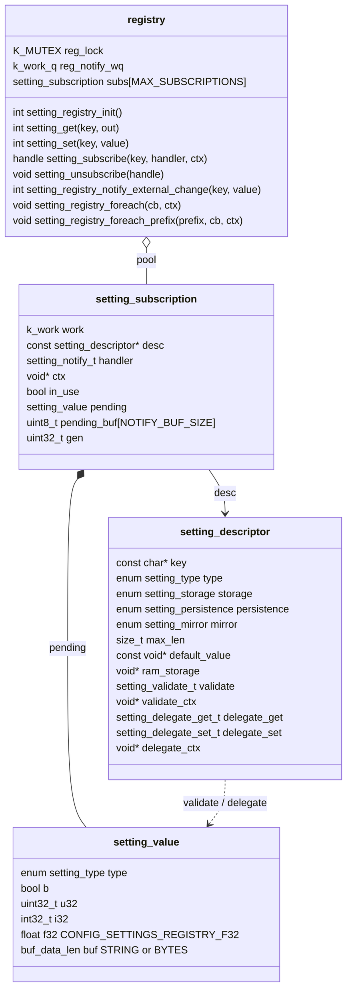
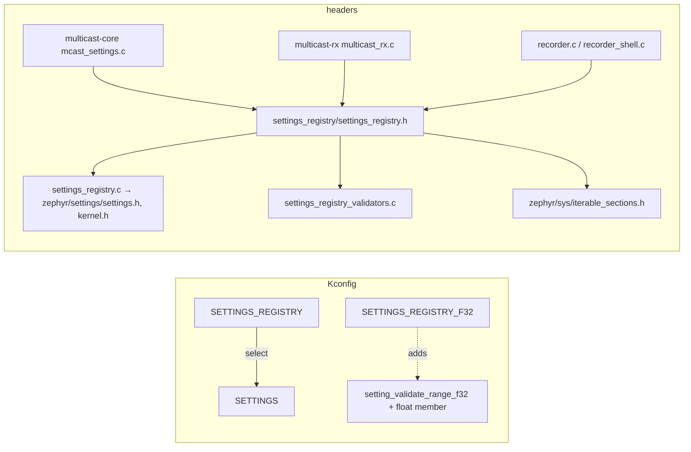
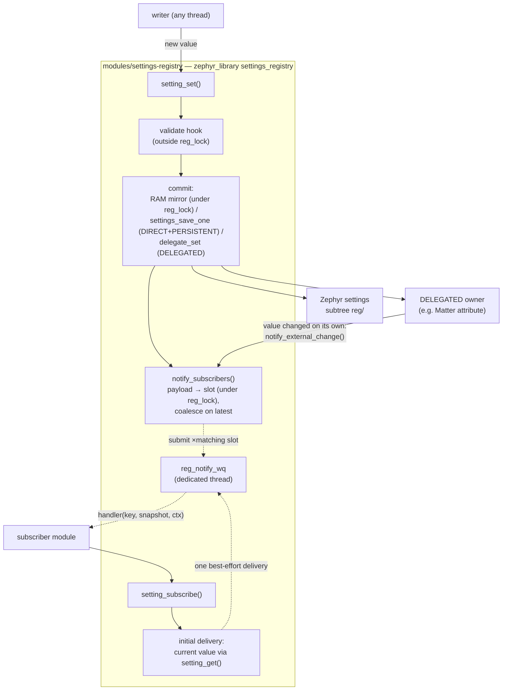
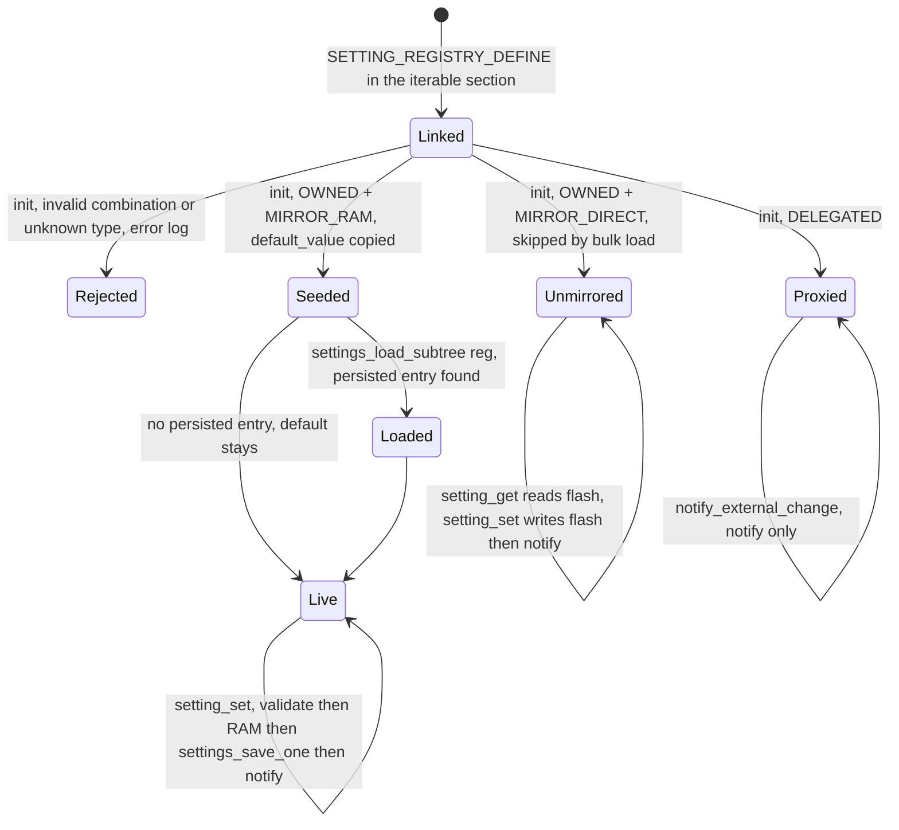
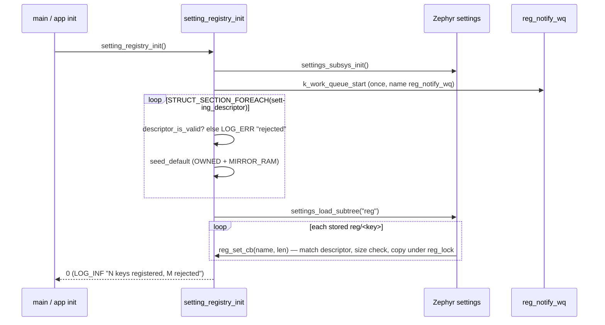
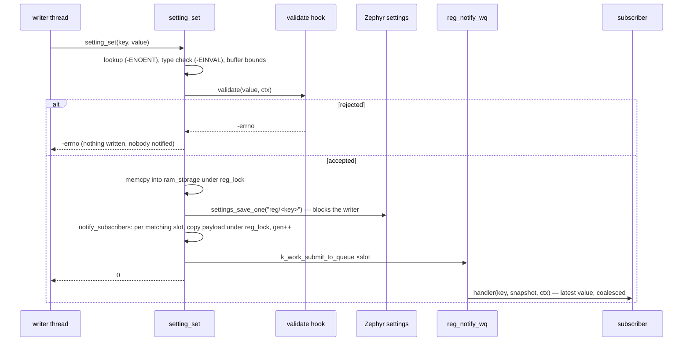
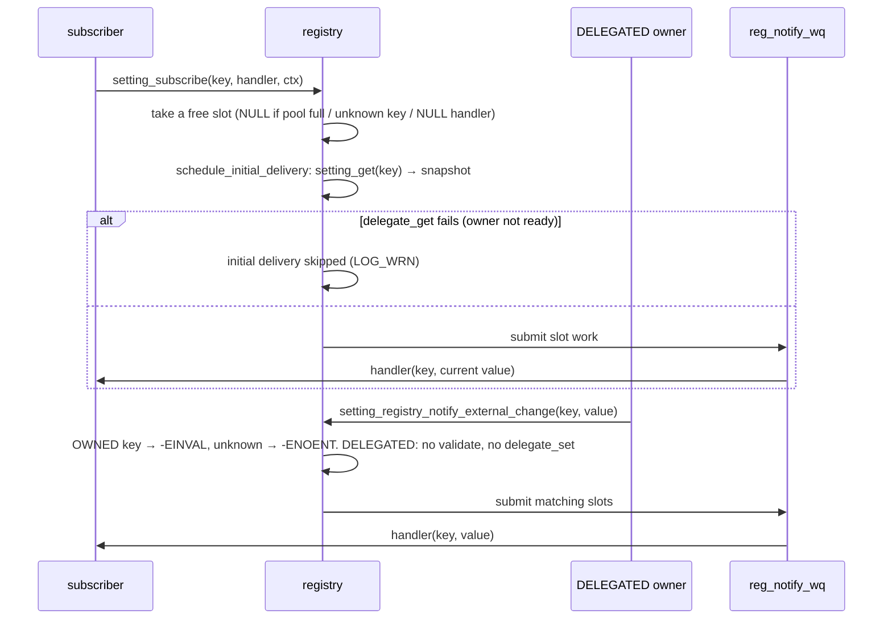
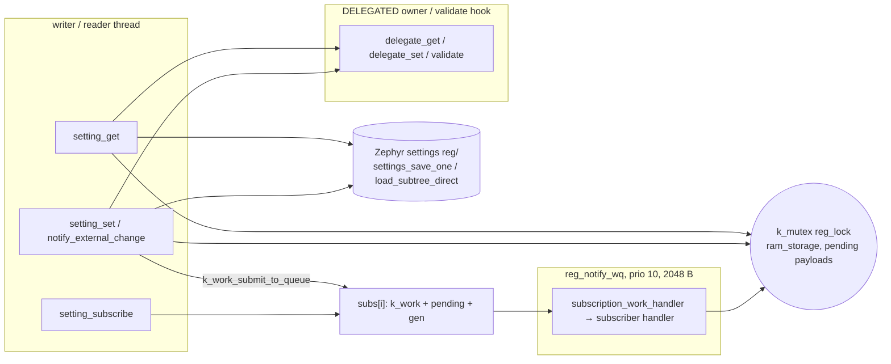
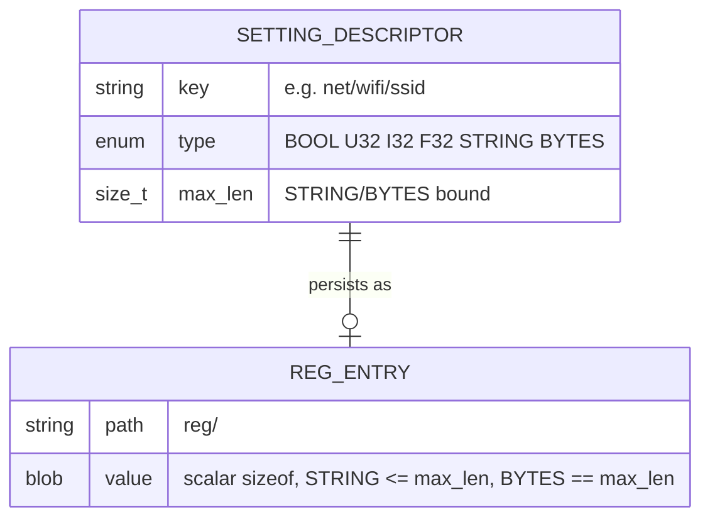

# settings-registry — generic per-key settings store

In-tree Zephyr module (`CONFIG_SETTINGS_REGISTRY`): a **generic, per-key
settings store** for cross-module configuration exposed to the future web
backend (network, Matter control, OTA, lock behaviour, keypad feedback, ...).
Each key is registered once, statically, next to the code that owns it —
no central list to edit when adding a setting — and picks independent
behaviours (storage, mirroring, persistence, validation, notification) at
registration time. See `include/settings_registry/settings_registry.h` for
the full API and the rationale behind each design decision. Plain C.

The module is fully implemented and covered by nine ztest suites
(`tests/settings_registry_*`, 70 tests) — see [Testing](#testing).

Where it is built (`CONFIG_SETTINGS_REGISTRY=y` lives in the three
multicast profiles, not in `prj.conf`):

| Image | Board | Profile / conf | This module | Note |
|---|---|---|---|---|
| Camera N6 `build_n6_mcast` | stm32n6570_dk | profiles/n6_mcast.conf | ✅ | keys from multicast-core (`mcast_settings.c`) |
| Camera N6 `build` (Matter) | stm32n6570_dk | prj.conf | ❌ | not set |
| Panel H750 `build_h750_mc` | stm32h750b_dk | profiles/h750_mc.conf | ✅ | keys from multicast-core, multicast-rx, recorder |
| Panel H750 `build_h750` (Matter) | stm32h750b_dk | prj.conf | ❌ | not set |
| Panel P4 `build_p4_mc` | esp32p4x_function_ev_board | profiles/p4_mc.conf | ✅ | same as H750 mc |
| Panel P4 `build_p4` (Matter) | esp32p4x_function_ev_board | prj.conf | ❌ | not set |
| Tests `tests/settings_registry_*` | native_sim | each suite's prj.conf | ✅ | 9 suites, `ZEPHYR_EXTRA_MODULES` |

Consumers in this repository (grep of `settings_registry.h` /
`SETTING_REGISTRY_DEFINE` outside the module):

| Consumer | File | Role |
|---|---|---|
| multicast-core | `modules/multicast-core/lib/mcast_settings.c`, `include/multicast_core/mcast_settings.h` | transport settings shared by camera TX and panel RX |
| multicast-rx | `modules/multicast-rx/lib/multicast_rx.c` | panel receive settings |
| recorder | `modules/recorder/lib/recorder.c`, `recorder_shell.c` | recorder settings + shell |

## Storage × Persistence × Mirror

Every key picks one value from each of the three enums below. The full
matrix (rows = Storage × Persistence, columns = Mirror):

| Storage \ Persistence | Mirror `RAM` | Mirror `DIRECT` |
|---|---|---|
| `OWNED` + `VOLATILE` | ✅ RAM only, resets to default at boot | ❌ rejected at init (nowhere to live) |
| `OWNED` + `PERSISTENT` | ✅ **the common case**: RAM mirror + `reg/` entry | ✅ no mirror, on-demand flash read/write |
| `DELEGATED` + `VOLATILE` | ✅ owner's hooks (`mirror` ignored) | ✅ identical to the RAM cell (`mirror` ignored) |
| `DELEGATED` + `PERSISTENT` | ❌ rejected (owner persists itself) | ❌ rejected |

What each valid combination gives you:

| Storage | Persistence | Mirror | Valid? | What it gives you |
|---|---|---|---|---|
| `OWNED` | `VOLATILE` | `RAM` | ✅ | Value lives only in `ram_storage`; resets to `default_value` on every boot. `setting_get()` is a plain memcpy, `setting_set()` updates RAM and notifies subscribers — no flash I/O, ever. Use for runtime-only state that must **not** survive a reboot (e.g. a maintenance-mode flag deliberately cleared by power-cycling). |
| `OWNED` | `VOLATILE` | `DIRECT` | ❌ invalid | Rejected — no RAM mirror and no persistence means the value has nowhere to live at all. |
| `OWNED` | `PERSISTENT` | `RAM` | ✅ the common case | RAM mirror, seeded from `default_value` and overwritten by the persisted entry (if any) in one bulk pass at `setting_registry_init()`. `setting_get()` is a memcpy; `setting_set()` updates RAM then blocks the caller for `settings_save_one()`. Use for ordinary settings — SSID, numeric thresholds, toggles. |
| `OWNED` | `PERSISTENT` | `DIRECT` | ✅ | No RAM mirror at all — skipped by the boot-time bulk load, zero RAM cost regardless of value size. Every `setting_get()` reads settings storage on demand (`settings_load_subtree_direct()`); every `setting_set()` writes straight through (`settings_save_one()`). Use for values too large to justify a standing RAM copy (multi-kilobyte strings/blobs) that are read rarely. |
| `DELEGATED` | `VOLATILE` | `RAM` | ✅ | The only meaningful `DELEGATED` row. `ram_storage` and `mirror` are both ignored — every `setting_get()`/`setting_set()` calls the owner's `delegate_get()`/`delegate_set()` hooks directly. Persistence, if any, is entirely the owner's business — that is why `persistence` must be `VOLATILE` here. Use for a value that already lives somewhere else (e.g. a Matter attribute). |
| `DELEGATED` | `VOLATILE` | `DIRECT` | ✅ identical to above | `mirror` has no effect for `DELEGATED` at all. |
| `DELEGATED` | `PERSISTENT` | `RAM` | ❌ invalid | Rejected — the owner decides its own persistence; the registry must never also try to persist a `DELEGATED` value. |
| `DELEGATED` | `PERSISTENT` | `DIRECT` | ❌ invalid | Same rule as above. |

Net: **`mirror` is a real choice only for `OWNED` + `PERSISTENT`**.
Everywhere else it is either forced (`OWNED` + `VOLATILE` can only be `RAM`)
or simply ignored (`DELEGATED`).

## What the module does

| # | Feature | Mechanism |
|---|---|---|
| 1 | **Static, link-time key registration** | `SETTING_REGISTRY_DEFINE()` → `STRUCT_SECTION_ITERABLE(setting_descriptor)` (slot in `lib/iterable.ld`); the set of valid keys is fixed at build time; invalid descriptors are rejected at `setting_registry_init()` with an error log and behave as if never registered |
| 2 | **Three independent behaviour axes per key** | storage (OWNED/DELEGATED), persistence (VOLATILE/PERSISTENT under the `reg/` subtree), mirroring (RAM/DIRECT) + optional **validation** (pre-commit hook) and **asynchronous change notifications** (per-key subscriptions on `reg_notify_wq`, never in the writer's context) |
| 3 | **Transport-agnostic by design** | the registry knows nothing about web, shell or Matter; the future web backend keeps its own allowlist of web-visible keys on its side; shell, tests and modules use the same API |

## Structure

```
modules/settings-registry/
├── zephyr/module.yml                # Zephyr module wrapper (cmake + kconfig)
├── CMakeLists.txt                   # exports include/; gates lib/ on CONFIG_SETTINGS_REGISTRY
├── README.md                        # this file
├── include/settings_registry/
│   └── settings_registry.h          # public API (the only public header) + full contract docs
└── lib/                             # zephyr_library "settings_registry"
    ├── Kconfig                      # SETTINGS_REGISTRY (menuconfig) + tunables
    ├── CMakeLists.txt
    ├── settings_registry.c          # core: descriptor table, get/set (all modes),
    │                                #   persistence ("reg/" subtree), subscriptions,
    │                                #   dedicated reg_notify_wq
    ├── settings_registry_validators.c  # the five built-in setting_validate_t helpers
    └── iterable.ld                  # linker section slot for the SETTING_REGISTRY_DEFINE
                                     #   descriptors (zephyr_linker_sources DATA_SECTIONS)
```

Source files and their size (`wc -l`):

| File | LOC | Role |
|---|---|---|
| `include/settings_registry/settings_registry.h` | 389 | value model, descriptor, `SETTING_REGISTRY_DEFINE`, validators, lifecycle/get/set/subscribe/enumerate |
| `lib/settings_registry.c` | 1121 | `reg_lock`, descriptor validation + seeding, `reg/` persistence (`SETTINGS_STATIC_HANDLER_DEFINE(settings_registry, "reg", ...)`), DIRECT reads, DELEGATED proxying, subscription pool + `reg_notify_wq` |
| `lib/settings_registry_validators.c` | 86 | `setting_validate_range_u32/_i32/_f32`, `_string_len`, `_u32_oneof` |
| `lib/iterable.ld` | 6 | `ITERABLE_SECTION_RAM(setting_descriptor, 4)` |

Descriptor and runtime objects (`settings_registry.h` / `.c`):



## Consuming the module

Register before `find_package(Zephyr)` (the application root CMakeLists does
exactly this; every `tests/settings_registry_*` suite does the same):

```cmake
list(APPEND ZEPHYR_EXTRA_MODULES ${PATH}/modules/settings-registry)  # Generic per-key settings store over Zephyr Settings (CONFIG_SETTINGS_REGISTRY)
```

Kconfig (`prj.conf`) — `SETTINGS` comes via `select`:

```
CONFIG_SETTINGS_REGISTRY=y
```

Define keys next to the owning code. The common case (OWNED + PERSISTENT +
RAM mirror) and a DELEGATED key proxied to its real owner:

```c
static char ssid_storage[33];
SETTING_REGISTRY_DEFINE(wifi_ssid,
        .key = "net/wifi/ssid",
        .type = SETTING_TYPE_STRING,
        .storage = SETTING_STORAGE_OWNED,
        .persistence = SETTING_PERSISTENT,
        .mirror = SETTING_MIRROR_RAM,
        .max_len = sizeof(ssid_storage),
        .default_value = "",
        .ram_storage = ssid_storage);

SETTING_REGISTRY_DEFINE(auto_relock,
        .key = "lock/auto_relock/timeout_s",
        .type = SETTING_TYPE_U32,
        .storage = SETTING_STORAGE_DELEGATED,
        .persistence = SETTING_VOLATILE, /* the owner persists it itself */
        .validate = setting_validate_range_u32,
        .validate_ctx = &(struct setting_range_u32){ .min = 0, .max = 600 },
        .delegate_get = matter_get_auto_relock,
        .delegate_set = matter_set_auto_relock);
```

Call `setting_registry_init()` once at startup, after settings-capable
storage is available and **before** the first `setting_get()`/`setting_set()`
— it validates every descriptor, seeds RAM mirrors with defaults, bulk-loads
the persisted `reg/` subtree and starts the notification work queue.

Persisted keys share the project's single Zephyr settings store with every
other module (`aliro/rdr`, `wifi`, `mas/...`) — keep
`CONFIG_SETTINGS_FILE_MAX_LINES` comfortably above the total number of
distinct keys, or every write degrades into a full-file rewrite (see the
header's file-level comment).

### Kconfig options

| Symbol | Type | Default | Range / depends / select | Effect |
|---|---|---|---|---|
| `SETTINGS_REGISTRY` | bool (menuconfig) | n | selects `SETTINGS` | builds `zephyr_library settings_registry` |
| `SETTINGS_REGISTRY_MAX_SUBSCRIPTIONS` | int | 16 | — | shared subscription slot pool (all keys); `setting_subscribe()` returns NULL when exhausted |
| `SETTINGS_REGISTRY_NOTIFY_WORKQ_STACK_SIZE` | int | 2048 | — | stack of `reg_notify_wq`; subscriber handlers run on it |
| `SETTINGS_REGISTRY_NOTIFY_WORKQ_PRIORITY` | int | 10 | — | priority of `reg_notify_wq` (same convention as lock_control's `notify_wq`) |
| `SETTINGS_REGISTRY_NOTIFY_BUF_SIZE` | int | 64 | — | per-subscription STRING/BYTES snapshot; longer values are truncated in the notification (with a warning) — subscribers call `setting_get()` for the full value |
| `SETTINGS_REGISTRY_F32` | bool | n | — | enables `SETTING_TYPE_F32` (float union member + f32 range validator); while off an F32 descriptor is rejected at init like an unknown type |
| `SETTINGS_REGISTRY_LOG_LEVEL` | choice | INF | `Kconfig.template.log_config` | `settings_registry` logger |

Who sets it:

| Config file | Value |
|---|---|
| `profiles/n6_mcast.conf`, `profiles/h750_mc.conf`, `profiles/p4_mc.conf` | `CONFIG_SETTINGS_REGISTRY=y` |
| `tests/settings_registry_access/prj.conf`, `tests/settings_registry_validate/prj.conf` | `CONFIG_SETTINGS_REGISTRY_F32=y` |
| `tests/settings_registry_notify/prj.conf` | `CONFIG_SETTINGS_REGISTRY_MAX_SUBSCRIPTIONS=4` |
| `prj.conf`, boards/*.conf | not set |

Kconfig and header dependencies:



## Architecture

Solid arrows are direct calls, dotted arrows are asynchronous deliveries.



A rejected write (validate or `delegate_set` refusing, or a persist error)
stops the chain — nothing downstream runs, no subscriber is notified. A
DELEGATED owner that changes its value *outside* `setting_set()` announces it
post-factum via `setting_registry_notify_external_change()` — that path
deliberately skips both `delegate_set()` and `validate()` (the value is
already committed at the source; calling them back would be the
set → delegate_set → set echo loop the function exists to break).

Key lifecycle, from link time to a live value:



| State | Entered when | Leaves on |
|---|---|---|
| Linked | the owning translation unit is linked | `setting_registry_init()` |
| Rejected | descriptor fails `descriptor_is_valid()` (invalid combo, F32 without `SETTINGS_REGISTRY_F32`, missing `ram_storage`, …) | never — enumeration skips it, get/set return `-ENOENT` |
| Seeded / Loaded / Live | OWNED + RAM: default copied, then possibly overwritten by `reg/<key>` (size-checked; ghost or oversized entries are warned and skipped) | every `setting_set()` |
| Unmirrored | OWNED + DIRECT | each get/set goes to flash (`settings_load_subtree_direct` / `settings_save_one`); a never-saved key returns `default_value` |
| Proxied | DELEGATED | owner's hooks on every get/set |

Registration and init sequence:



Write + notify path (OWNED + PERSISTENT + RAM):



Subscribe with initial delivery, and an external change from a DELEGATED
owner:



## Threading

| Context | Kind | Priority | Stack | Created by | Runs | Blocks on | Touches |
|---|---|---|---|---|---|---|---|
| writer / reader (any thread) | caller | caller's | caller's | — | `setting_get`, `setting_set`, `subscribe`, `unsubscribe`, `notify_external_change`, `foreach*` | `reg_lock` (short), flash I/O on PERSISTENT set / DIRECT get | RAM mirrors and pending payloads under `reg_lock`; validate / delegate / flash outside it |
| `reg_notify_wq` | k_work_q thread | `SETTINGS_REGISTRY_NOTIFY_WORKQ_PRIORITY` (10) | `SETTINGS_REGISTRY_NOTIFY_WORKQ_STACK_SIZE` (2048) | `setting_registry_init()` (once) | `subscription_work_handler` → subscriber handler with a local copy of the snapshot | queued work | slot payload under `reg_lock`, then the handler outside it |
| settings subsystem callback | caller of `settings_load_subtree` (init thread) | caller's | caller's | Zephyr settings | `reg_set_cb` (bulk load), `direct_read_cb` (DIRECT get) | flash read | RAM mirror under `reg_lock` |



- `reg_lock` (module mutex) guards only the RAM mirrors and the pending
  notification payloads. **Flash I/O, delegate hooks, validate hooks and
  subscriber handlers all run outside it.**
- `setting_set()` on a PERSISTENT key **blocks the caller** for the flash
  write — do not call it from a context that cannot block (this is why the
  planned web `PUT` handler hands off to `k_work` instead of writing inline
  in the single-threaded `http_server` loop).
- Notification delivery is asynchronous: one `k_work` per subscription; the
  writer only submits and never waits. Back-to-back changes coalesce — a
  handler always sees the **latest** value (level, not edge, semantics).
  STRING/BYTES payloads are delivered from a per-slot copy
  (`SETTINGS_REGISTRY_NOTIFY_BUF_SIZE`), never from the writer's buffer.
- Subscribing schedules one immediate best-effort delivery of the current
  value through the same path; for a DELEGATED key whose owner is not ready
  yet (`delegate_get()` fails) that first delivery is silently skipped.

## Public API

All declarations live in `include/settings_registry/settings_registry.h`
(C, `extern "C"` guards). Lifecycle: define keys statically →
`setting_registry_init()` once → get/set/subscribe from anywhere.

| Function | Semantics | Context | Returns / errno |
|---|---|---|---|
| `int setting_registry_init(void)` | Validate descriptors, seed RAM mirrors, bulk-load `reg/` (DIRECT keys skipped), start the notification queue. Call before the first get/set. | init thread, once | 0; negative errno from `settings_subsys_init` / `settings_load_subtree` |
| `int setting_get(const char *key, struct setting_value *out)` | Read: memcpy from the RAM mirror, on-demand settings read (DIRECT; never-saved key → `default_value`), or `delegate_get()`. STRING/BYTES go through the caller's buffer (`out->buf.data`/`len` = capacity in, size out; STRING NUL-terminated, `len` excludes the NUL). | any thread; may block on flash (DIRECT) | 0; `-ENOENT`; `-EINVAL` (type mismatch); `-ENOSPC` (buffer too small); delegate errno |
| `int setting_set(const char *key, const struct setting_value *value)` | Write: type check → `validate` → commit (RAM and/or `settings_save_one`, or `delegate_set`) → notify. Nothing runs downstream of a rejection. | any thread; blocks on PERSISTENT | 0; `-ENOENT`; `-EINVAL`; errno from validate/delegate as-is; persist errno |
| `setting_subscription_handle_t setting_subscribe(key, handler, ctx)` | Subscribe to one key; schedules one immediate best-effort delivery of the current value. | any thread | handle; NULL (unknown key, NULL handler, pool full) |
| `void setting_unsubscribe(handle)` | Remove a subscription; NULL is a no-op. | any thread | void |
| `int setting_registry_notify_external_change(key, value)` | DELEGATED-only anti-echo announcement; subscribers notified, `delegate_set()`/`validate()` not called. | any thread | 0; `-ENOENT`; `-EINVAL` (OWNED key or type mismatch) |
| `void setting_registry_foreach(cb, ctx)` | `cb` once per valid descriptor, registration order. | any | void |
| `void setting_registry_foreach_prefix(prefix, cb, ctx)` | Same, filtered by key prefix (e.g. `"net/"`); NULL/empty ≡ `foreach`. | any | void |

Error codes:

| errno | Meaning | Recovery |
|---|---|---|
| `-ENOENT` | key not registered (or rejected at init) | check the key string / init log |
| `-EINVAL` | type mismatch, NULL buffer for STRING/BYTES, BYTES length ≠ `max_len`, `notify_external_change` on an OWNED key, validator refusal (built-ins) | fix the caller |
| `-ENOSPC` | caller's STRING/BYTES buffer smaller than the stored value | pass a buffer of `max_len` (+1 for STRING) |
| validate / delegate errno | propagated verbatim from the hook | per-key policy |
| settings errno | `settings_subsys_init`, `settings_load_subtree`, `settings_save_one` failures | storage problem; value not committed, nobody notified |

Built-in validators (`setting_validate_t` implementations; `validate_ctx`
points at the matching parameter struct). All return 0 to accept, `-EINVAL`
to reject; a NULL/wrong-typed input is rejected the same way (registration
bug, not a runtime case):

| Validator | ctx struct | Accepts | Type |
|---|---|---|---|
| `setting_validate_range_u32` | `setting_range_u32{min, max}` | inclusive range | `U32` |
| `setting_validate_range_i32` | `setting_range_i32{min, max}` | inclusive range | `I32` |
| `setting_validate_range_f32` | `setting_range_f32{min, max}` | inclusive range; only with `CONFIG_SETTINGS_REGISTRY_F32` | `F32` |
| `setting_validate_string_len` | `setting_string_len{min_len, max_len}` | `buf.len` within `[min_len, max_len]`, NUL excluded; further restricts the descriptor's `max_len` | `STRING` |
| `setting_validate_u32_oneof` | `setting_u32_oneof{allowed[], count}` | membership in the allowed array | `U32` |

Persisted record of one OWNED + PERSISTENT key:



## Testing

Nine ztest suites under `tests/settings_registry_*`, one per implementation
phase, each consuming the module the real way (`ZEPHYR_EXTRA_MODULES` + the
module's own Kconfig); 70 tests total:

| Suite | Path | Cases | What it proves | Runner |
|---|---|---|---|---|
| `settings_registry.build` | `tests/settings_registry_build` | 1 | the module links and `init()` returns 0 | `scripts/run_tests_docker.sh settings_registry_build …` |
| `settings_registry.core` | `tests/settings_registry_core` | 8 | descriptor table: invalid combinations rejected, defaults seeded, `foreach`/`foreach_prefix` (umbrella, no match, NULL/empty ≡ foreach) | same |
| `settings_registry.access` | `tests/settings_registry_access` | 8 | scalar get/set round-trips (BOOL/U32/I32/F32), `-ENOENT`/`-EINVAL`, key isolation, defaults visible via get | same (`F32=y`) |
| `settings_registry.strings` | `tests/settings_registry_strings` | 9 | STRING/BYTES caller-supplied buffer contract: round-trips, empty, `max_len` boundary, `-ENOSPC`, BYTES wrong length rejected, type mismatch | same |
| `settings_registry.validate` | `tests/settings_registry_validate` | 7 | the five built-in validators (inclusive bounds), a custom hook, verbatim rejection-code propagation, value intact on refusal | same (`F32=y`) |
| `settings_registry.persist` | `tests/settings_registry_persist` | 5 | OWNED+PERSISTENT+RAM: save + bulk-load across a simulated reboot (NVS backend), default when never written, VOLATILE not persisted, ghost `reg/` entries warn-and-skip | same |
| `settings_registry.direct` | `tests/settings_registry_direct` | 9 | MIRROR_DIRECT: on-demand read/write (scalar, string, bytes), defaults from the descriptor, survives re-init, `-ENOSPC`/`-EINVAL`, validate applies, visible without a mirror | same |
| `settings_registry.delegated` | `tests/settings_registry_delegated` | 7 | DELEGATED proxying: ctx delivery, error propagation, validate before `delegate_set`, type mismatch → no hook call, no registry `max_len` bounds, OWNED regression | same |
| `settings_registry.notify` | `tests/settings_registry_notify` | 16 | subscriptions: fan-out, filtering, every successful set notifies, rejected set does not, unsubscribe, pool overflow (`MAX_SUBSCRIPTIONS=4`), string payload copies, delegated set notifies, initial delivery (default / after set / string / skipped when owner not ready / coalesces with an immediate set), `notify_external_change` (skips owner + validate; error codes) | same |

On macOS run them in Docker/Colima (native_sim does not execute natively
there — see the script header for the one-time Colima prereq):

```
scripts/run_tests_docker.sh settings_registry_build settings_registry_core \
    settings_registry_access settings_registry_strings settings_registry_validate \
    settings_registry_persist settings_registry_direct settings_registry_delegated \
    settings_registry_notify
```

Judge the result **only** by the `SUITE PASS` / `PROJECT EXECUTION SUCCESSFUL`
lines — the script's exit code is always 1.

On-target checks (mc images): no shell of its own — the consumers' shells
(`mcast`, `mcastrx`, `rec`) read and write their keys through this API.

## Not implemented (deliberately)

| Item | Status | Notes |
|---|---|---|
| static registration, three axes, validation, notifications | ✅ done | 70 tests |
| **Runtime key registration** (`CONFIG_SETTINGS_REGISTRY_DYNAMIC`) | ❌ missing | fully designed (heap-backed linked list alongside the static section, per-key targeted `settings_load_subtree_direct()` on creation), deferred to a separate phase; nothing in the current API changes for it |
| **A dedicated "validation failed" error code** | ❌ missing | `setting_set()` propagates whatever `validate()`/`delegate_set()` returned, without distinguishing the two. Deliberately deferred |
| **Variable-length BYTES** | ❌ by design | a BYTES blob is fixed at `max_len` (nowhere to store an actual length); `setting_set()` requires exactly `max_len` bytes |
| `F32` values | ⚠️ optional | only with `CONFIG_SETTINGS_REGISTRY_F32` (tests enable it; no image does) |

## Discrepancies code ↔ docs

| Where (doc/comment) | Says | Code / tree does |
|---|---|---|
| earlier README (Testing) | run via `esp32p4/scripts/run_tests_docker.sh …` | the script lives at `scripts/run_tests_docker.sh` of this repo; its own header/`WORKSPACE` still point at the old `esp32p4` layout (`/Volumes/LocalData/Programming/Zephyr/4.4`, `/workdir/esp32p4/tests`) |
| `scripts/run_tests_docker.sh` default suite list | "default: all suites under esp32p4/tests" | the default `TESTS` array does not include any `settings_registry_*` suite — pass them explicitly |
| `lib/Kconfig` help of `NOTIFY_WORKQ_PRIORITY` | "Cooperative/preemptible priority" | value 10 is passed to `k_work_queue_start` as-is: non-negative → preemptible |
